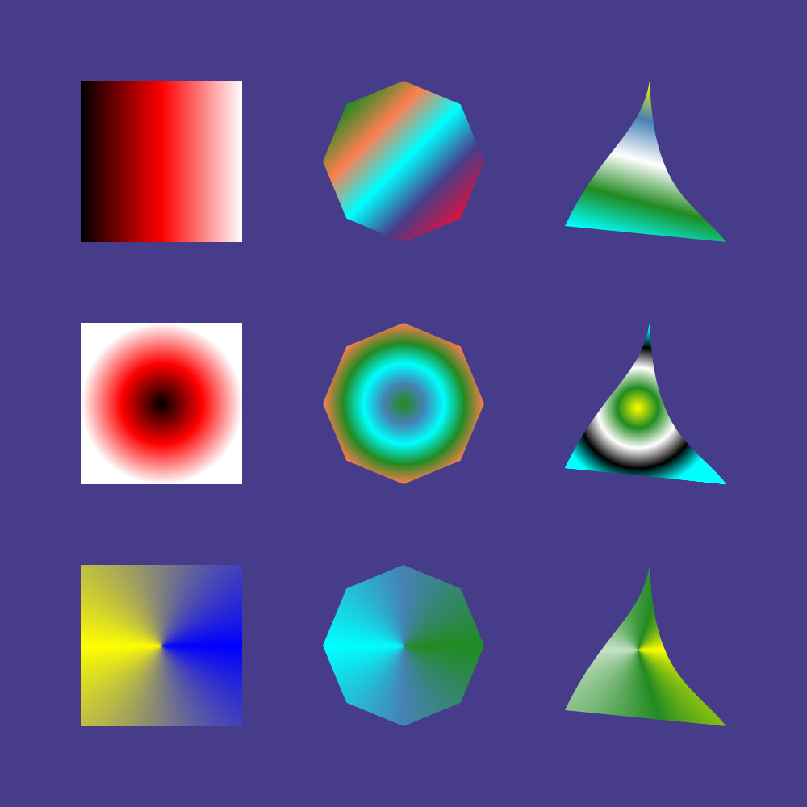

[](https://github.com/AlexandruIca/verg/actions/workflows/ci.yml)

# Verg

This is a WIP vector graphics rendering library. Its goal is to be simple to use and easy to embed in existing projects. It doesn't necessarily want to implement a lot of features. Currently supported things are:
- Rendering quadratic and cubic Bézier curves
- Gradients: linear, radial, conic
- Porter-Duff blending

Here are some demos rendered with the library:




The focus is more on the quality of the renderer rather than the number of features it supports. The work is based on Raph Levien's [font-rs](https://github.com/raphlinus/font-rs) (more precisely: the line rendering algorithm). Rendering of quadratic Bézier curves is also based on Raph Levien's work: [Flattening Quadratic Bézier Curves](https://raphlinus.github.io/graphics/curves/2019/12/23/flatten-quadbez.html). Cubics are rendered using De Casteljau subdivision: [Piecewise Linear Approximationof Bézier Curves](https://hcklbrrfnn.files.wordpress.com/2012/08/bez.pdf).

# Setting up a development environment
You can check `scripts/shell.nix` (even if you don't use nix) to see the dependencies that are needed (all of them can be gathered with `rustup`). Unfortunately the `shell.nix` is clutteret with `ghc` and `latex` even though they're not needed for running the examples, they are there because this is my bachelor's thesis at the same time, and I use them for documentation/testing stuff.

To run the project's tests:
```sh
cargo test --all-features
```
